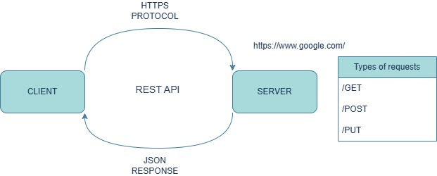
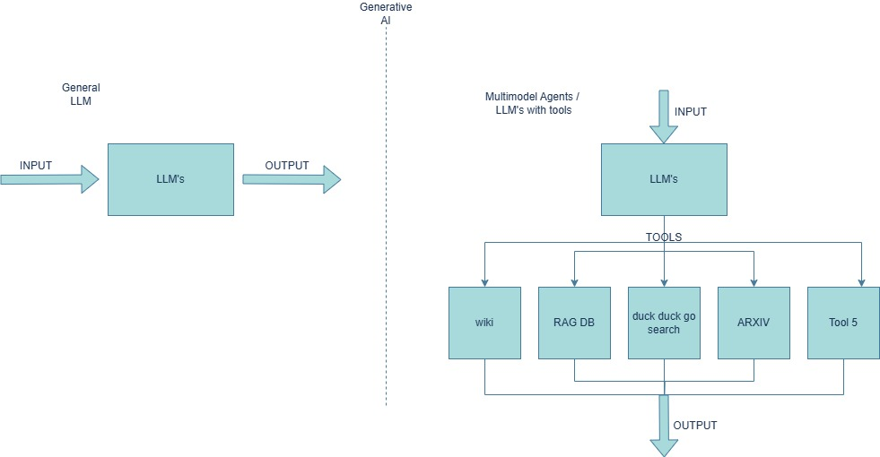

# [Model Context Protocol (MCP)](https://modelcontextprotocol.io/introduction)

## First let's understand the idea behind MCP: 
### Website communication in general: 

### So far what we came across about LLM’s: 

### Advantages of LLM’s with tools:
1. Can answer more complex real-time queries 
2. Can provide custom data for the model to fetch the results 
3. By providing context of the tools to the LLM, it will be able to provide results based on the linked tools. 

### Disadvantages of LLM’s with tools: 
1. For each tool we need to write a custom integration code. 
2. More the tools, more the integration code. 
3. For any update by the tool provider, you need to change the integration logic for the respective tool. 
4. Code maintainability. 

> #### *Issue here is*: 
> - We cannot scale our AI assistant with many tools and many service providers as you need to manage a lot of code. 
> - Here comes the MCP into picture. 

### MCP brief definition: 
- MCP acts as a medium between LLM and the tool providers. 
- The MCP protocol will be a single medium where all the tool providers need to follow this protocol, so that anyone who is developing an AI assistant should be using the MCP protocol to connect to the specific tools.

### Components in MCP: 

- **MCP Host** - Implement the interaction of client to server. 
- **MCP Client** – Internally in the host we will create clients that will connect to the tools and other service providers. 
  - The MCP client will connect to the MCP server. 
- **MCP Server** – It is connected to different resources or tools or services. 

The host basically creates the client. The client will be communicating with the MCP Server to interact with tool providers with the help of MCP protocol. The response from the MCP server will then be shown at MCP host (IDE’s/ application/ etc.) 

The tools or services are completely managed by tool providers. Any changes made to the tools are handled by service providers, so there will be no changes required to be made for the client-server integration happening via MCP protocol. 
  

### Communication between the MCP components: 

This is the step-by-step process that will be happening between the components. 

1. Input query will be provided to the MCP Host (Fast API application). 
2. The MCP Client which is running on the MCP Host will hit the MCP server with the input. 
3. The MCP Server then returns all the tools available at the server back to MCP Host. 
4. The MCP Host will then hit the LLM with the input query along with the available tools. 
5. Then LLM sends a response to MCP Host which tool to use. 
6. MCP Host will then call the MCP server with a specific tool. 
7. The response is sent back to MCP Host.  
8. The MCP Host will call the LLM with the context and then LLM sends the final output. 

### MCP Server implementation:
**Python SDK**: `pip install mcp[cli]`

MCP server using python-sdk has majorly 4 components: 

**[Resources](https://modelcontextprotocol.io/docs/concepts/resources):** 
Resources are how you expose data to LLMs. They're like GET endpoints in a REST API - they provide data but shouldn't perform significant computation or have side effects 

*Example:* 

**[Tools](https://modelcontextprotocol.io/docs/concepts/tools):**
Tools let LLMs take actions through your server. Unlike resources, tools are expected to perform computation and have side effects. 

*Example:*

**[Prompts](https://modelcontextprotocol.io/docs/concepts/prompts):**
Prompts are reusable templates that help LLMs interact with your server effectively. 

*Example:*

**[Transports](https://modelcontextprotocol.io/docs/concepts/transports):**
Transports in the Model Context Protocol (MCP) provide the foundation for communication between clients and servers. A transport handles the underlying mechanics of how messages are sent and received. 

MCP includes two standard transport implementations: 
1. Standard Input/Output (stdio) 
2. Server-Sent Events (SSE) 